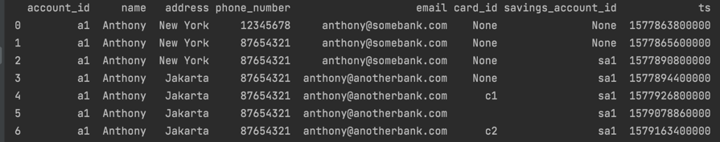
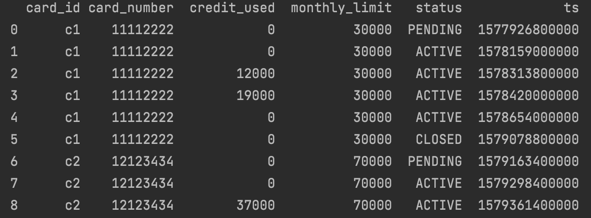
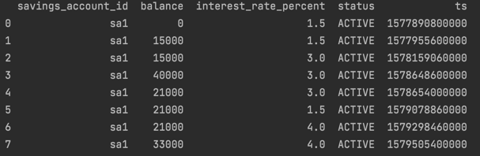
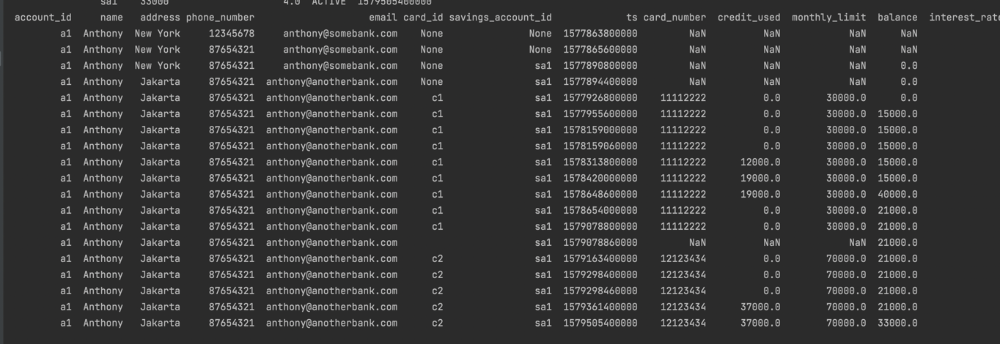
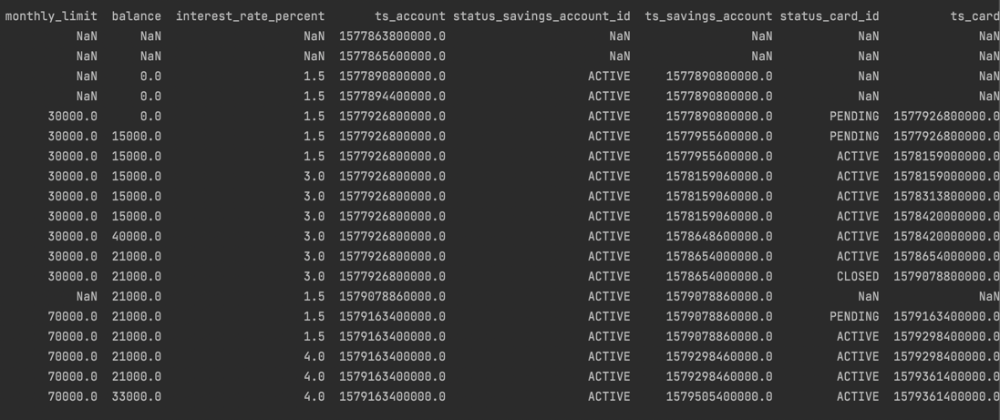
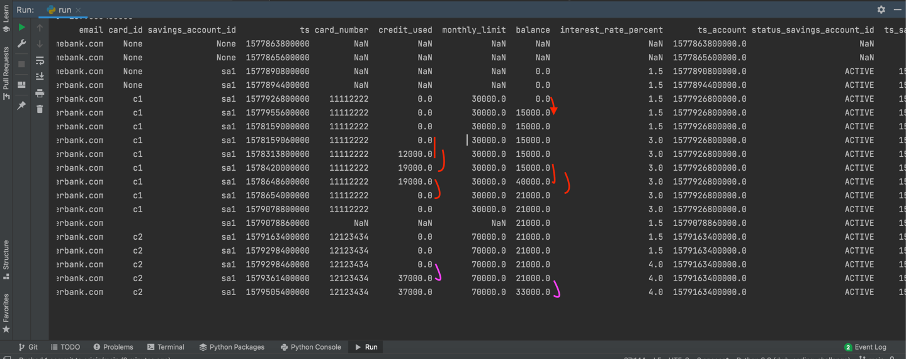
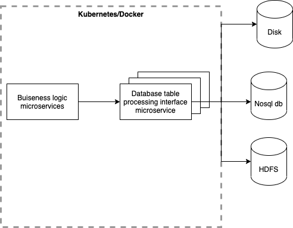

# DWH Coding Challenge results

Each history table and joined table printed out to the stdout.

## 1. History tables

I've printed out history tables for each of the event tables.

## 2. Joined table
2 screenshots provided here of printed out tables

## 3. Number of transactions

Total of 8 transactions. 
6 transactions for the first card c1, 2 transactions after tying up second card.

examples of transactions with credit_used:
1. 0 -> 12000
2. 12000 -> 19000
3. 19000 -> 0
etc. 

## 4. Thoughts on the process, future work

I would do an interface implementation of access to the data - to transfer then to nosql (i.g. hbase) or hdfs. And implement this as a microservice.
Also introduce it to the k8s or cloud orcestration service.