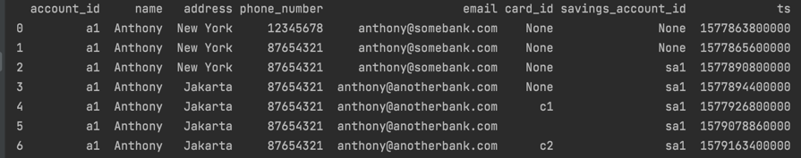
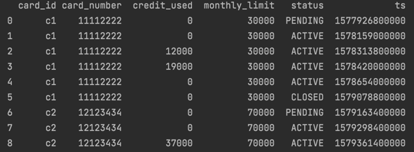
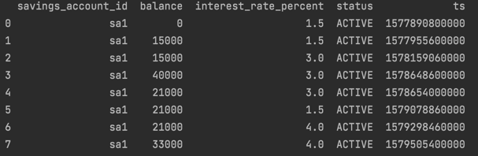
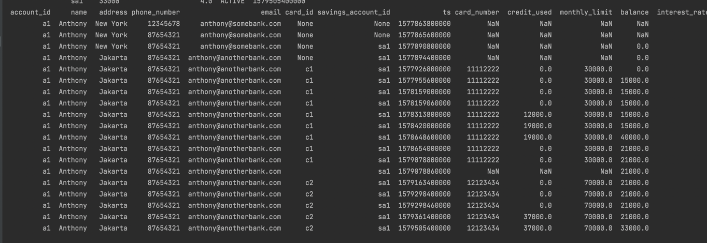
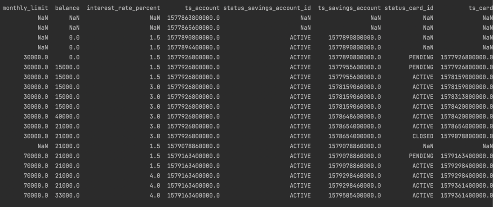
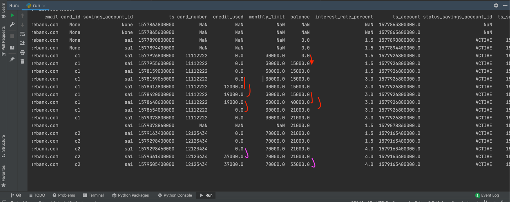

# DWH Coding Challenge results

Each history table and joined table printed out to the stdout.

## 1. History tables

I've printed out history tables for each of the event tables.

## 2. Joined table
2 screenshots provided here of printed out tables

## 3. Number of transactions

Total of 8 transactions. 
6 transactions for the first card c1, 2 transactions after tying up second card.
